<h1 align="center">基于Spring Boot 的小区物业智能卡管理系统【带论文】</h1>

- <b>完整代码获取地址：从戎源码网 ([https://armycodes.com/](https://armycodes.com/))</b>
- <b>技术探讨、资料分享，请加QQ群：692619798</b>
- <b>作者微信：19941326836  QQ：3645296857</b>
- <b>承接计算机毕业设计、Java毕业设计、Python毕业设计、深度学习、机器学习</b>
- <b>选题+开题报告+任务书+程序定制+安装调试+论文+答辩ppt 一条龙服务</b>
- <b>所有选题地址 ([https://github.com/Descartes007/allProject](https://github.com/Descartes007/allProject)) </b>

## 一、项目介绍

### 基于 Spring Boot 的小区物业智能卡管理系统，主要角色为管理员（后台）与业主（前端）。主要功能如下：
### 管理员（后台）：
- 基本操作：登录、登出、修改密码、获取/修改个人信息、获取 session 用户信息
- 用户管理：分页/列表查询、查看详情、新增、修改、删除、重置密码、注册管理
- 业主管理：业主分页/详情、新增（默认密码）、修改、逻辑删除、批量导入（xls）、业主密码重置/忘记密码处理
- 停车管理：车辆入出（停车登记）分页/详情、新增、修改、删除、批量导入、级联业主信息显示
- 费用管理：费用记录分页/详情、新增、修改、删除、批量导入
### 业主服务：服务请求分页/详情、新增、修改、管理员审核（shenhe）、删除、批量导入
- 公告管理：公告分页/详情、新增、修改、删除、批量导入
- 留言板：留言分页/详情、新增、修改、删除、批量导入、回复记录管理
- 业主（前端）：
- 账号：注册、登录、登出、获取/修改个人信息、密码重置/忘记密码
- 查看与操作：查看公告、留言（新增/查看）、提交业主服务请求、查看个人停车记录、缴费/查看费用记录、文件上传（如图片/附件）
- 列表/详情：查看自己的列表数据（系统根据 role/session 过滤，仅能查看/操作自身相关数据）

## 二、项目技术

- 后端框架与库：Spring Boot 2.x、MyBatis / MyBatis‑Plus、FastJSON、Apache POI、Hutool、Commons‑IO，MySQL
- 前端框架与库：Vue 2、Vue Router、Axios、Element UI、ECharts

## 三、运行环境

- JDK版本：1.8及以上都可以
- 操作系统：Windows7/10、MacOS
- 开发工具：IDEA、Ecplise、MyEclipse都可以

## 四、数据库配置文件

- npm版本：6.14.13及以上都可以
- Redis版本：3.2.100及以上都可以
- 文件名：application.yml
- 编码类型：utf8

## 论文截图

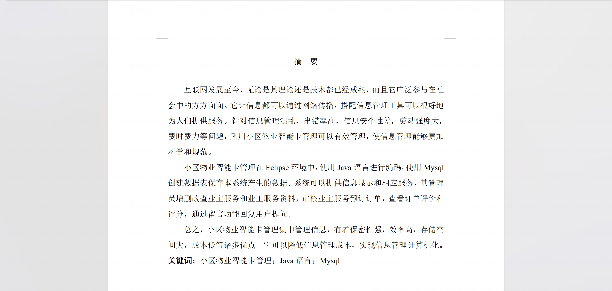

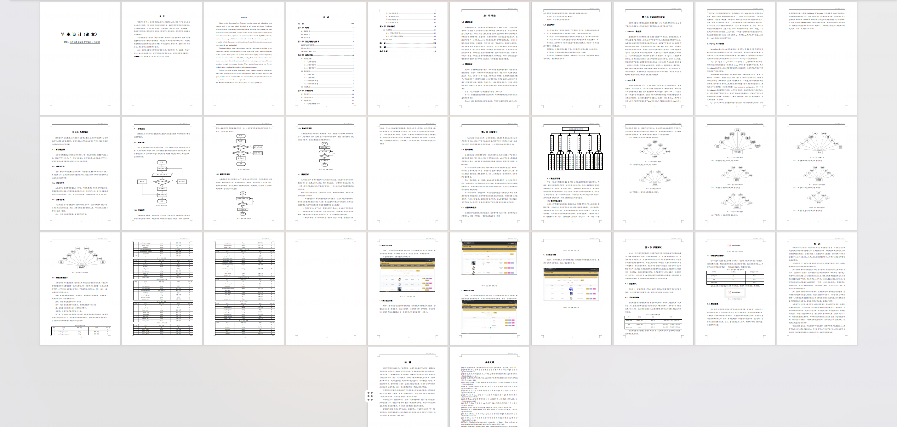

## 系统截图

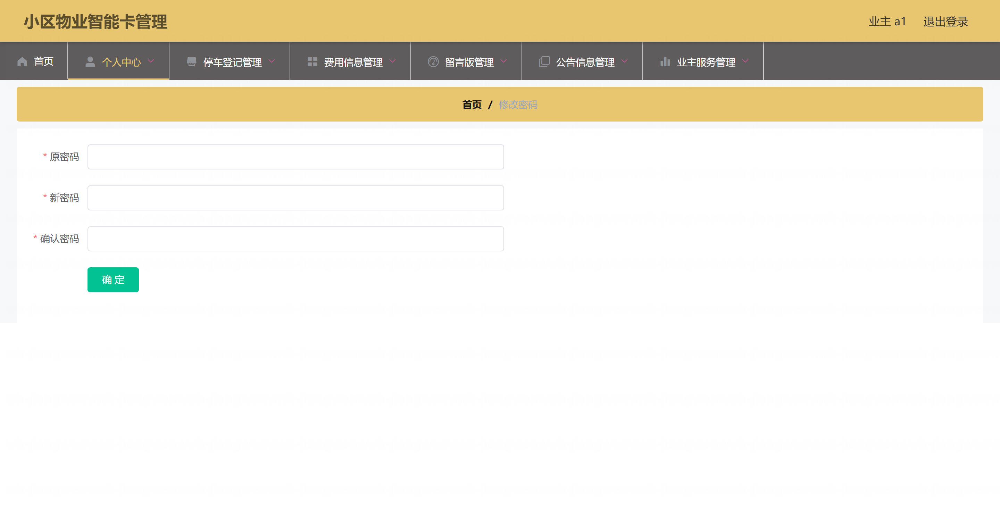

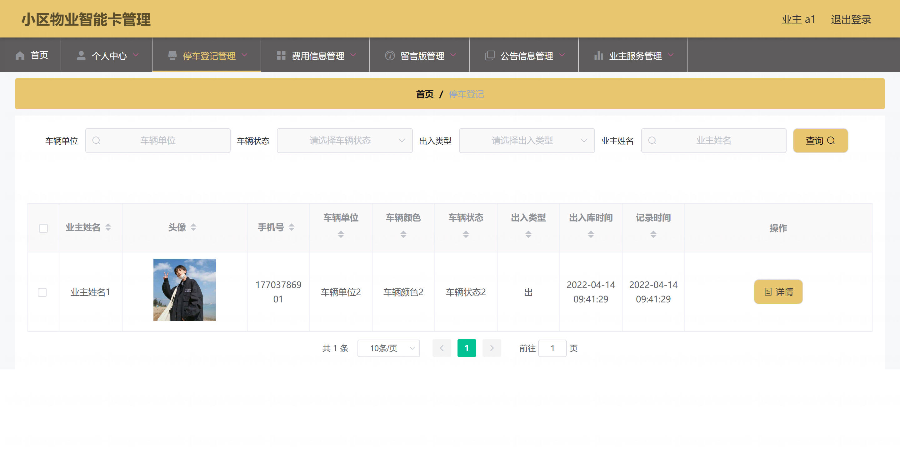

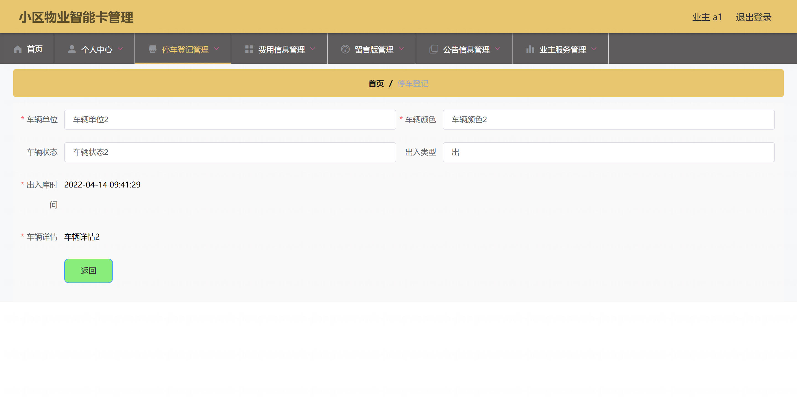

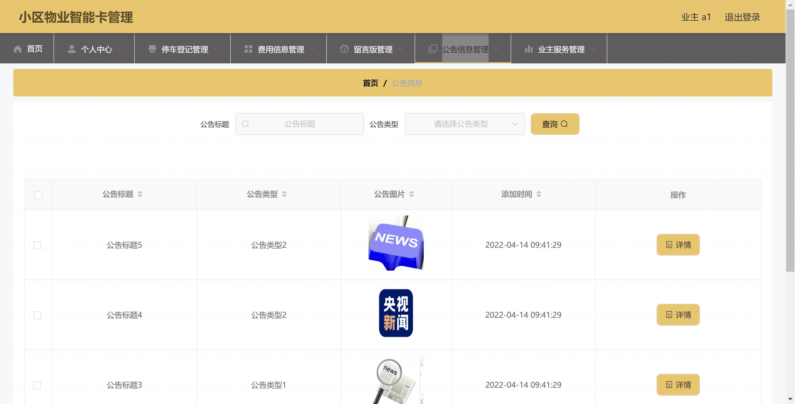

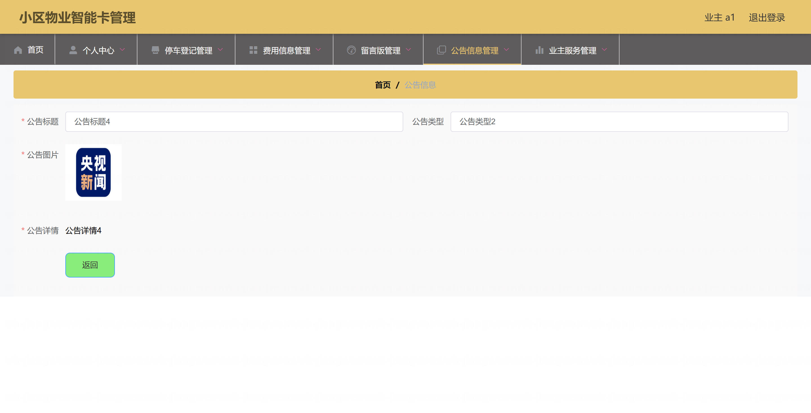

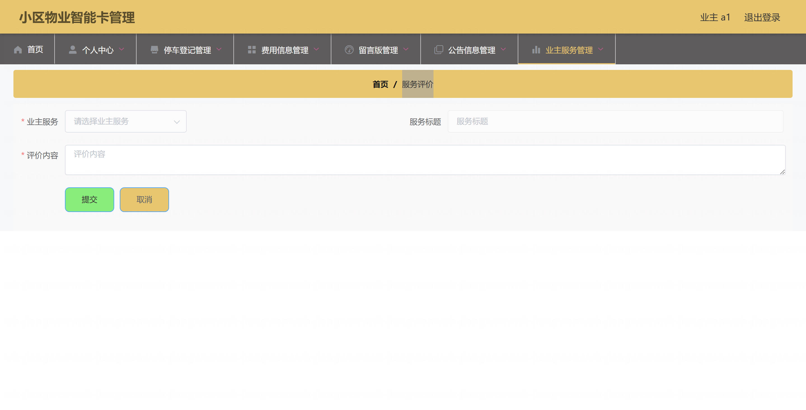

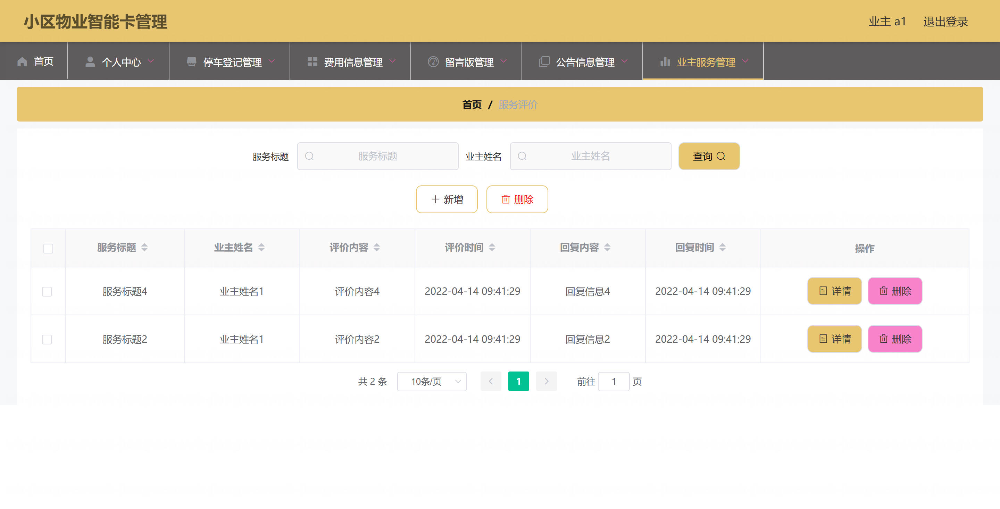

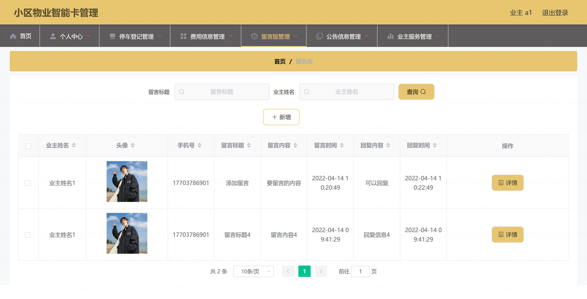

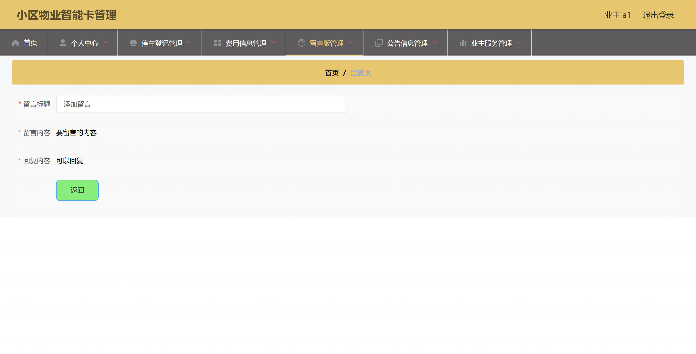